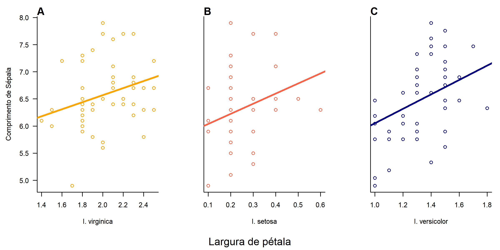

```{r setup, include=FALSE}
knitr::opts_chunk$set(echo = TRUE)
```

## Introdução
O exercício pedia pra que sejam comparadas os valores morfométricos de pétala e sépala entre três espécies de Iris (Iridaceae).


## Leitura do arquivo
Para a leitura do arquivo, será usada uma database padrão do R com a função *data()*


```{r, echo=TRUE, eval=T}
data(iris)
summary(iris)
```

## Modelos lineares, coeficientes e intercepto
Foram feitos modelos lineares onde foram extraídos os coeficientes de cada uma das espécies com a função *coef*

```{r, echo=TRUE, eval=T}
#Fazendo os coeficientes de intercepto
seto <- lm(Sepal.Length ~ Petal.Width, data=iris[iris$Species=="setosa",])
virg <- lm(Sepal.Length ~ Petal.Width, data=iris[iris$Species=="virginica",])
vers <- lm(Sepal.Length ~ Petal.Width, data=iris[iris$Species=="versicolor",])
coefseto <- coef(seto)
coefvirg <- coef(virg)
coefvers <- coef(vers)

```

## Organização dos gráficos
Os gráficos foram previamente organizados usando a função *par* e definindo o endereço de saída do gráfico com a função *png*

```{r, echo=TRUE, eval=T}
#Definindo o dispositivo gráfico numa pasta
png("figs/resultado08.png", res=300, width=2400, height=1200)
#Primeiro: colocando todos na mesma coluna e direcionando os gráficos
par(mfrow=c(1,3), bty='l', las=1,
    mar=c(7, 4.5, 2, 1))
#Plotando os gráficos
#Indexando os valores para apenas uma espécies (I. virginica)
plot(Sepal.Length ~ Petal.Width, data=iris[iris$Species=="virginica",],
     #Selecionando cor
     col="orange",
     #Definindo limites e rótulos
      ylab="Comprimento de Sépala", xlab="I. virginica")
#Adicionando os coeficientes
abline(a=coefvirg[1], b=coefvirg[2],
       col='orange', lwd=3)
mtext("A", 3, adj=0, font=2)

#Repetindo o processo de plotagem
plot(Sepal.Length ~ Petal.Width, data=iris[iris$Species=="setosa",],
     col="tomato",
     #Nos próximos plots, serão escondidos os rótulos do eixo Y
     xlab="I. setosa", yaxt='n', ylab = "")
abline(a=coefseto[1], b=coefseto[2],
       col='tomato', lwd=3)
mtext("B", 3, adj=0, font=2)
#Adicionando a legenda compartilhada no eixo X
mtext("Largura de pétala",side=1,outer=TRUE,padj=-1.5)

plot(Sepal.Length ~ Petal.Width, data=iris[iris$Species=="versicolor",],
                                col="navy",
                              xlab="I. versicolor", yaxt='n', ylab = "")
abline(a=coefseto[1], b=coefseto[2],
       col='navy', lwd=3)
mtext("C", 3, adj=0, font=2)
#Visualizando o gráfico
dev.off()
```

Ao final, teremos um gráfico desse jeito
```{r, echo=F, eval=T}

```


